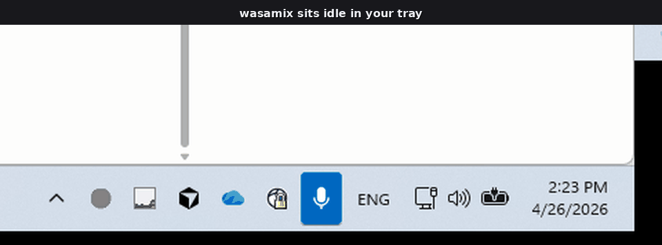
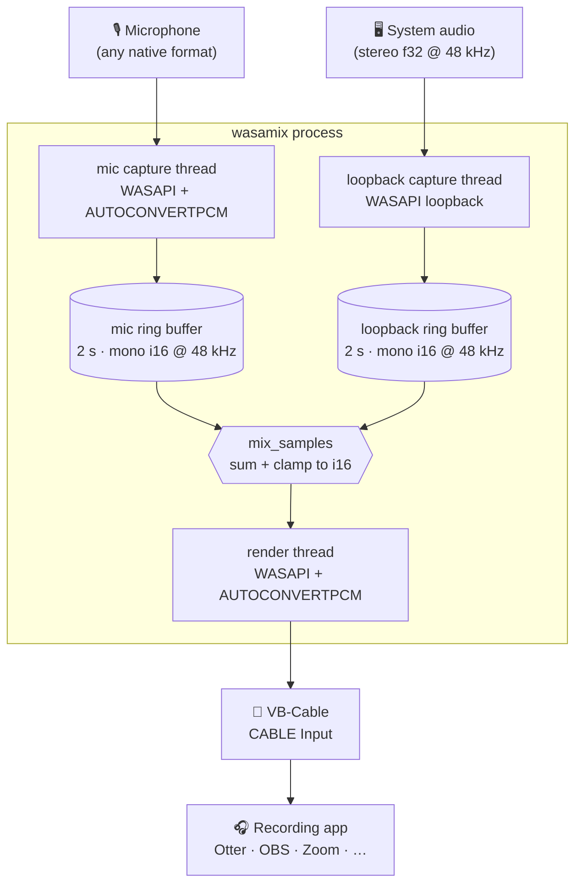

# wasamix

[](https://github.com/ytchenak/wasamix/actions/workflows/ci.yml)
[](#license)
[](#requirements)
[](https://www.rust-lang.org)

A tiny Windows system-tray app that mixes your **microphone** with your **system audio** and pipes the result into **VB-Audio Virtual Cable** — so any app that can record from a microphone (Otter, Teams, Zoom, OBS, browser recorders) can capture you *and* whatever you're listening to.

No window, no UI chrome. Just a tray icon: left-click to start, left-click to stop.



> Right-click the tray icon to pick your system-audio source, then left-click to start mixing into VB-Cable. The icon turns green while running.

---

## Features

- **Zero-setup mixing** — pick your mic once, click to start. Saved to `config.json` next to the exe.
- **System audio capture via WASAPI loopback** — no kernel drivers, no reroute hacks.
- **Real-time, low-latency** — event-driven WASAPI on three dedicated threads; ~5–20 ms end-to-end.
- **Format-agnostic inputs** — 16 kHz Bluetooth mic, 48 kHz USB interface, stereo f32 loopback: all normalized internally to mono i16 @ 48 kHz.
- **Bluetooth-friendly loopback** — if the default render device rejects loopback init, falls back through other render devices automatically.
- **Tiny footprint** — single ~2 MB executable, no installer, no background service.

## Requirements

- **Windows 10 / 11** (x86-64). No Linux/macOS — the app is built on WASAPI.
- **[VB-Audio Virtual Cable](https://vb-audio.com/Cable/)** installed. Free; donate-ware.
- **Rust stable** (edition 2024) if building from source.

## Install

### Prebuilt binary

Grab `wasamix.exe` from the [Releases page](https://github.com/ytchenak/wasamix/releases) and drop it anywhere — e.g., `C:\Tools\wasamix\`. First run creates `config.json` alongside it.

### From source

```bash
git clone git@github.com:ytchenak/wasamix.git
cd wasamix
cargo build --release
# → target/release/wasamix.exe
```

## Usage

1. Launch `wasamix.exe`. A grey circle icon appears in the system tray.
2. **Right-click** the icon → pick your microphone. (The selection is saved; you only need to do this once.)
3. **Left-click** the icon → it turns green. Mic + system audio are now being mixed into `CABLE Input`.
4. In your recording app (Otter, OBS, etc.), set the input device to **`CABLE Output (VB-Audio Virtual Cable)`**.
5. **Left-click** again to stop.

### Behavior notes

- Selecting a different mic while mixing is disabled by design — stop first, switch, then start.
- Choosing a mic in the menu does **not** auto-start mixing. Left-click is the only start trigger.
- Closing the app always stops capture and releases the cable cleanly.

## How it works



- Every WASAPI thread calls `CoInitializeEx(MTA)` on entry (COM is per-thread on Windows).
- Ring buffers are `Arc<Mutex<RingBuffer>>`, 2 s capacity; overflow drops oldest bytes, underflow pads with silence.
- Shutdown is coordinated by a single `Arc<AtomicBool>`; `impl Drop for Pipeline` guarantees threads are joined even on panic.
- Mic stream is opened with `AUDCLNT_STREAMFLAGS_AUTOCONVERTPCM` so WASAPI resamples weird native formats (e.g., Bluetooth HSP @ 16 kHz) for us. Loopback stream uses the device mix format and converts in Rust.

See [`CLAUDE.md`](CLAUDE.md) for the architecture walkthrough and platform gotchas.

## Building & testing

```bash
cargo build                        # debug
cargo build --release              # optimized, stripped

cargo run                          # launch the tray app
cargo run --bin test_pipeline      # 5-second end-to-end smoke test
cargo run --bin test_capture       # WASAPI loopback diagnostic across all render devices

cargo test                         # unit tests (ring buffer, mix, config, device filtering)
cargo test audio::mixer            # a single module
cargo fmt --all
cargo clippy --all-targets -- -D warnings
```

If the MSVC linker isn't found, see the [Git-shadows-link.exe note in `.cargo/config.toml`](./.cargo/config.toml) — you may need to update the pinned MSVC path.

## Contributing

PRs and issues welcome. See [CONTRIBUTING.md](./CONTRIBUTING.md) for the short version and [CODE_OF_CONDUCT.md](./CODE_OF_CONDUCT.md) for behavior expectations. For security issues, please read [SECURITY.md](./SECURITY.md) instead of opening a public issue.

## License

Dual-licensed under either of:

- **Apache License, Version 2.0** ([LICENSE-APACHE](./LICENSE-APACHE) or <https://www.apache.org/licenses/LICENSE-2.0>)
- **MIT license** ([LICENSE-MIT](./LICENSE-MIT) or <https://opensource.org/licenses/MIT>)

at your option. This matches the standard Rust-ecosystem dual-licensing pattern.

Unless you explicitly state otherwise, any contribution intentionally submitted for inclusion in this project — as defined in the Apache-2.0 license — shall be dual-licensed as above, without any additional terms or conditions.
